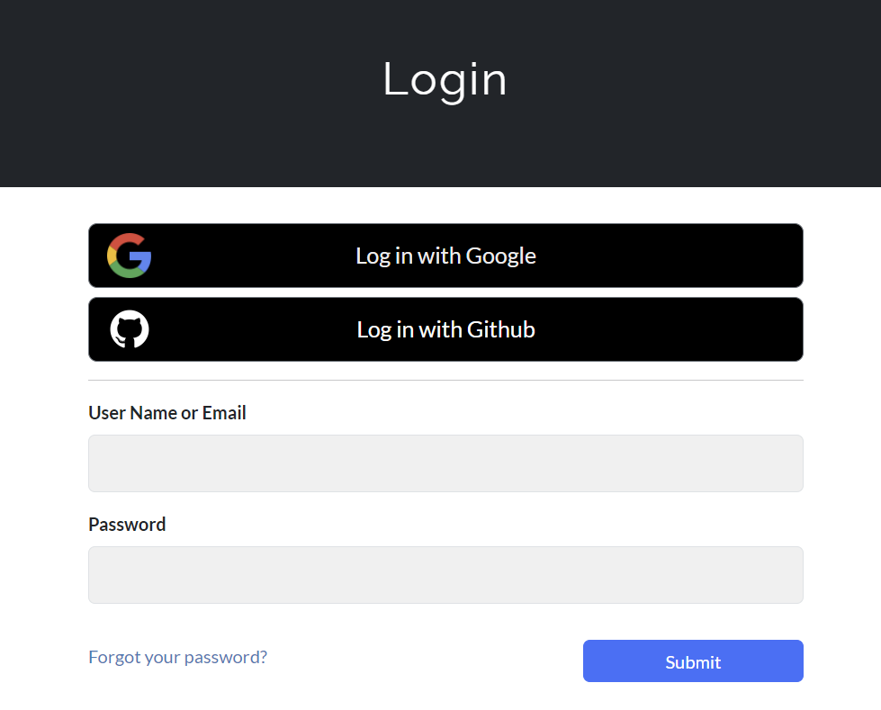
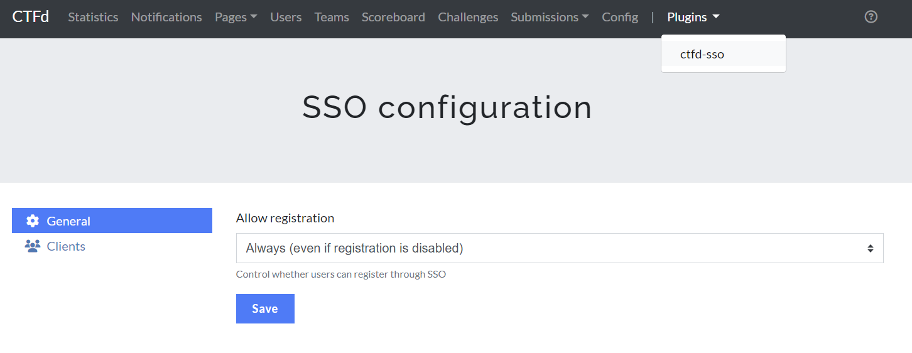
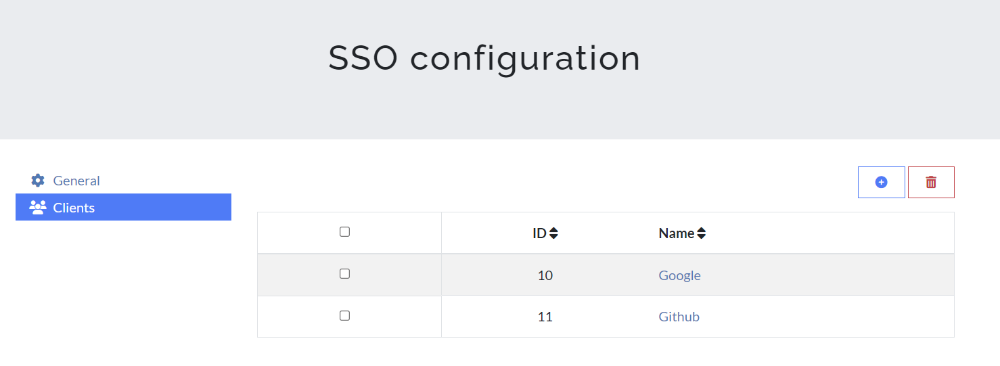
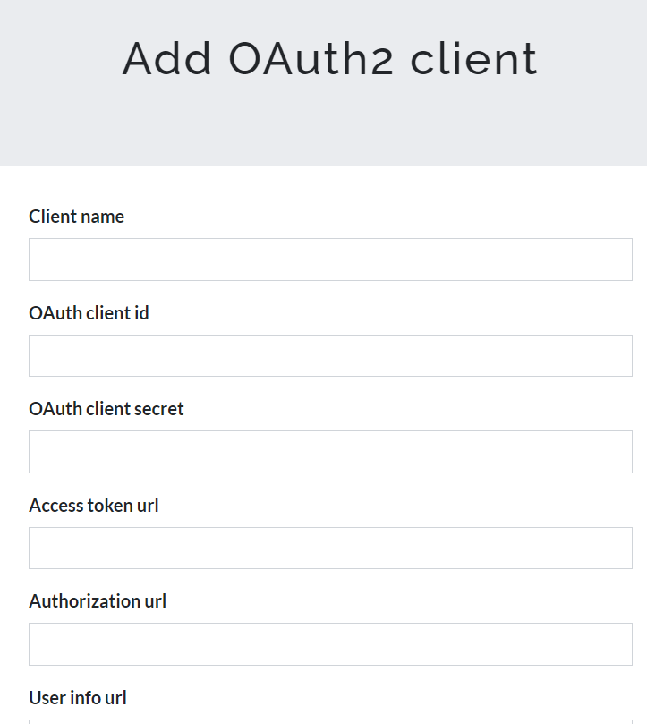

# CTFd-SSO-plugin

Do you want to allow users easy access to your CTF? Or do you want to allow access only to users in your organization via SSO? This CTFd plugin allows you to do so.

CTFd SSO plugin allows administrators to configure login using the OAuth2 protocol. It works with a wide variety of providers, including Google.

## Development and contributions

Currently this project is not actively maintained but sporadically updates or fixes may be made.

At the bottom of this document you can find the next scheduled updates, if you find bugs or have suggestions you can open an issue and I will be happy to respond as soon as possible.

## Compatibility

This plugin has been tested with CTFd v3.7 but should work with any version of CTFd v3.x.x.

In addition, the plugin was tested only with authentication through Google but is compatible with any provider that supports the OAuth2 protocol with an endpoint to get the user's information.

## Installation

1. Clone this repository to [CTFd/plugins](https://github.com/CTFd/CTFd/tree/master/CTFd/plugins).
2. Install required python packages. If you are using Docker to run CTFd just rebuild the container, instead if you are using other hosting solutions you can install them manually by running command `pip3 install -r requirements.txt` from the plugin folder (`CTFd/plugins/CTFd-SSO-plugin`).
3. Edit the `[extra]` section of `CTFd/config.ini` adding this value:
   - `OAUTH_CREATE_BUTTONS`: set `False` if you do not want to automatically add the OAuth login buttons in the login page (it works only with the default theme). Default is `True`.
4. Start or restart CTFd.
5. In the `Admin Panel` go to `Plugins`>`ctfd-sso`. There you can view and delete existing clients, or add a new one by pressing plus symbol.
6. Insert a client name (it will be shown on the button) and the other information according to the identity provider. Then press `Add`.
7. Log in :)

## Admin accounts

If you want to automatically create admin accounts via the Identity Provider, make sure that the API Endpoint returns a key `roles` containing an array. The first element of that array will be set as the user role in CTFd.

For example if an user should be admin, the Identity Provider should return something like: `{"preferred_username": "username", "email": "example@ctfd.org", "roles": ["admin"]}`

The allowed roles for CTFd are `admin` and `user`, but the latter is set by default.

## Login buttons

If configured properly, this plugin will attempt to automatically insert the login buttons in the login page. It might fail if the theme isn't the original one. In this case or if you want to create some custom buttons, they should point to `sso/login/<client_id>`.

## Screenshots

## Next updates

- Improve documentation of configuration processes with major providers (Google, Github, Keycloak...)
- Better control and management of the case when the provider does not return the necessary user information
- Allow customization of roles and permissions configuration, e.g., via the email address domain and not just via the "role" field
- Allow the administrator to choose whether users should show up as verified or not
