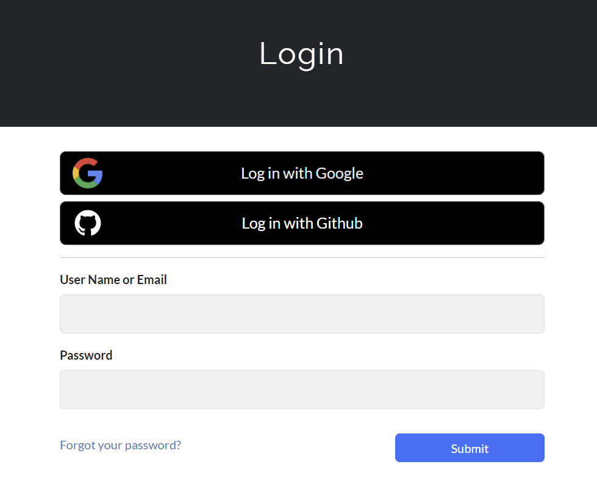
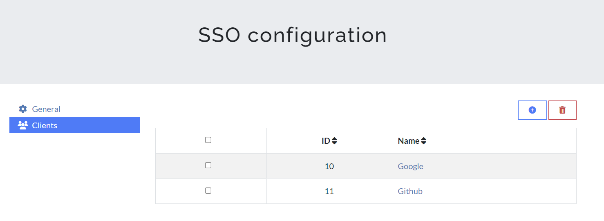
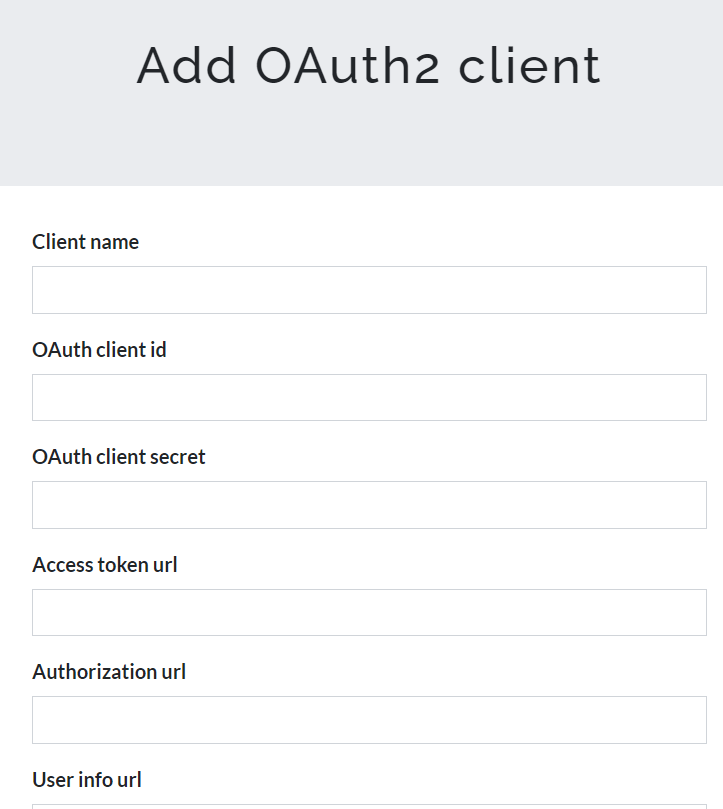
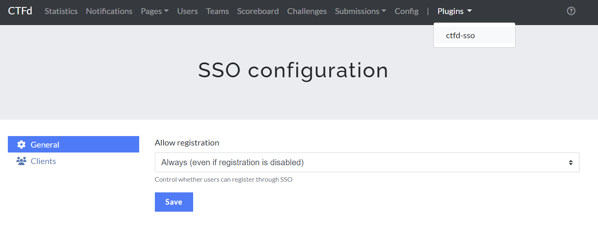

# CTFd SSO Plugin

> Add OAuth 2.0 Single Sign-On to your [CTFd](https://github.com/CTFd/CTFd) instance — support any identity provider that speaks OAuth 2.0.



## Table of Contents

- [Features](#features)
- [Compatibility](#compatibility)
- [Installation](#installation)
- [Configuration](#configuration)
  - [Global settings](#global-settings)
  - [OAuth client fields](#oauth-client-fields)
  - [config.ini key](#configini-key)
- [Provider setup guides](#provider-setup-guides)
  - [Google](#google)
  - [GitHub](#github)
  - [Keycloak](#keycloak)
- [Role-based admin assignment](#role-based-admin-assignment)
- [Custom login buttons](#custom-login-buttons)
- [Screenshots](#screenshots)
- [Contributing](#contributing)
- [License](#license)

---

## Features

- **Multiple providers** — add as many OAuth 2.0 identity providers as you need from the admin panel.
- **Automatic user registration** — optionally create CTFd accounts on first login; respects the global CTFd registration toggle.
- **Automatic user verification** — mark users as verified the moment they authenticate via SSO.
- **Role sync** — map an identity-provider role claim to CTFd's `admin` / `user` role.
- **Customisable login buttons** — configure button label, text colour, background colour, icon, and display order per provider.
- **Works with the default theme** — buttons are injected automatically; custom-theme support via manual URL links.

## Compatibility

| CTFd version | Status           |
| ------------ | ---------------- |
| v3.7 – v3.8  | ✅ Tested        |
| Other v3.x   | ✅ Should work   |
| v2.x         | ❌ Not supported |

Any OAuth 2.0 provider that exposes a userinfo endpoint (returning JSON) is supported, including Google, GitHub, GitLab, Keycloak, Authentik, and more.

## Installation

1. **Clone this repository** into CTFd's plugin directory:

   ```bash
   cd CTFd/plugins
   git clone https://github.com/riccardotornesello/CTFd-SSO-plugin
   ```

2. **Install Python dependencies:**
   - **Docker** — rebuild the CTFd container; the `requirements.txt` is picked up automatically.
   - **Other deployments** — run the following from the plugin directory:

     ```bash
     pip install -r CTFd/plugins/CTFd-SSO-plugin/requirements.txt
     ```

3. _(Optional)_ **Edit `CTFd/config.ini`** to disable automatic button injection (see [config.ini key](#configini-key)).

4. **Start or restart CTFd.**

5. **Add an identity provider** — in the Admin Panel go to **Plugins › SSO Authentication**, then click the **+** button, fill in the client details, and press **Add**.

6. **Test the login flow** — open the login page and click the new SSO button.

## Configuration

### Global settings

These settings are available under **Admin Panel › Plugins › SSO Authentication**:

| Setting                        | Description                                                                                                                                  | Default                                    |
| ------------------------------ | -------------------------------------------------------------------------------------------------------------------------------------------- | ------------------------------------------ |
| **Allow registration**         | Controls whether new users can create a CTFd account through SSO. Choose _Only when registration is globally enabled_, _Always_, or _Never_. | Only when registration is globally enabled |
| **Automatically verify users** | Marks users as verified upon SSO login, bypassing the email-verification step.                                                               | Enabled                                    |

### OAuth client fields

Each identity-provider client is configured with the following fields:

| Field                       | Description                                                               | Example                                            |
| --------------------------- | ------------------------------------------------------------------------- | -------------------------------------------------- |
| **Key**                     | Unique identifier used in redirect URLs and internally. Must be URL-safe. | `google`                                           |
| **Display name**            | Label shown on the login button.                                          | `Login with Google`                                |
| **Button text color**       | Hex colour for the button label.                                          | `#ffffff`                                          |
| **Button background color** | Hex colour for the button background.                                     | `#4285F4`                                          |
| **Button icon**             | PNG image displayed on the login button (optional).                       | —                                                  |
| **Display order**           | Integer controlling the order buttons appear on the login page.           | `0`                                                |
| **Authorization URL**       | OAuth 2.0 authorisation endpoint of the provider.                         | `https://accounts.google.com/o/oauth2/auth`        |
| **Token URL**               | OAuth 2.0 token endpoint of the provider.                                 | `https://oauth2.googleapis.com/token`              |
| **User info URL**           | Endpoint that returns the authenticated user's profile as JSON.           | `https://openidconnect.googleapis.com/v1/userinfo` |
| **Client ID**               | The client ID issued by the provider.                                     | —                                                  |
| **Client secret**           | The client secret issued by the provider.                                 | —                                                  |
| **Scope**                   | Space-separated list of OAuth scopes to request.                          | `openid email profile`                             |
| **Username claim**          | JSON key in the userinfo response used as the CTFd username.              | `preferred_username`                               |
| **Email claim**             | JSON key in the userinfo response used as the CTFd email.                 | `email`                                            |

### config.ini key

Add the following key to the `[extra]` section of `CTFd/config.ini` to control automatic button injection:

```ini
[extra]
# Set to False to disable automatic SSO button injection into the login page.
# Useful when using a custom theme or when you prefer to add buttons manually.
OAUTH_CREATE_BUTTONS = True
```

## Provider setup guides

### Google

1. Open the [Google Cloud Console](https://console.cloud.google.com/) and create a new project (or select an existing one).
2. Navigate to **APIs & Services › Credentials** and click **Create credentials › OAuth client ID**.
3. Choose **Web application**, then add your CTFd redirect URI as an authorised redirect URI:
   ```
   https://<your-ctfd-domain>/sso/redirect/google
   ```
4. Copy the **Client ID** and **Client secret**.
5. In CTFd, create a new SSO client with:

   | Field             | Value                                                            |
   | ----------------- | ---------------------------------------------------------------- |
   | Key               | `google`                                                         |
   | Authorization URL | `https://accounts.google.com/o/oauth2/auth`                      |
   | Token URL         | `https://oauth2.googleapis.com/token`                            |
   | User info URL     | `https://openidconnect.googleapis.com/v1/userinfo`               |
   | Scope             | `openid email profile`                                           |
   | Username claim    | `<empty>`, the username will be generated from the email address |
   | Email claim       | `email`                                                          |

### GitHub

1. Go to **GitHub › Settings › Developer settings › OAuth Apps** and click **New OAuth App**.
2. Set the **Authorization callback URL** to:
   ```
   https://<your-ctfd-domain>/sso/redirect/github
   ```
3. Copy the **Client ID** and generate a **Client secret**.
4. In CTFd, create a new SSO client with:

   | Field             | Value                                         |
   | ----------------- | --------------------------------------------- |
   | Key               | `github`                                      |
   | Authorization URL | `https://github.com/login/oauth/authorize`    |
   | Token URL         | `https://github.com/login/oauth/access_token` |
   | User info URL     | `https://api.github.com/user`                 |
   | Scope             | `read:user user:email`                        |
   | Username claim    | `login`                                       |
   | Email claim       | `email`                                       |

   > **Note:** GitHub only returns a user's email address if it is set to public, or if the `user:email` scope is requested and the user has a primary email. Consider using a dedicated endpoint if you need reliable email access.

### Keycloak

1. In your Keycloak realm, go to **Clients** and click **Create**.
2. Set **Client ID** to something like `ctfd`, choose **openid-connect** as the protocol, and set **Access Type** to `confidential`.
3. Add the redirect URI:
   ```
   https://<your-ctfd-domain>/sso/redirect/keycloak
   ```
4. From the **Credentials** tab, copy the **Client secret**.
5. In CTFd, create a new SSO client with (replace `<realm>` and `<keycloak-domain>`):

   | Field             | Value                                                                       |
   | ----------------- | --------------------------------------------------------------------------- |
   | Key               | `keycloak`                                                                  |
   | Authorization URL | `https://<keycloak-domain>/realms/<realm>/protocol/openid-connect/auth`     |
   | Token URL         | `https://<keycloak-domain>/realms/<realm>/protocol/openid-connect/token`    |
   | User info URL     | `https://<keycloak-domain>/realms/<realm>/protocol/openid-connect/userinfo` |
   | Scope             | `openid email profile`                                                      |
   | Username claim    | `preferred_username`                                                        |
   | Email claim       | `email`                                                                     |

## Role-based admin assignment

The plugin can automatically promote or demote a CTFd user based on a `roles` claim returned by the identity provider's userinfo endpoint.

**Requirements:**

- The userinfo endpoint must return a `roles` key containing a JSON array.
- The **first** element of that array must be either `"admin"` or `"user"`.

**Example userinfo response:**

```json
{
  "preferred_username": "alice",
  "email": "alice@example.com",
  "roles": ["admin"]
}
```

If the claim is absent or the role is not recognised, the user keeps their existing CTFd role (defaulting to `user` for new accounts).

## Custom login buttons

When `OAUTH_CREATE_BUTTONS` is `True` (the default) the plugin automatically injects login buttons into CTFd's default login page template.

If you are using a **custom theme** or prefer to control the buttons yourself, set `OAUTH_CREATE_BUTTONS = False` in `config.ini` and add buttons to your template that point to:

```
/sso/login/<client_key>
```

where `<client_key>` is the **Key** you set when creating the client (e.g. `/sso/login/google`).

## Screenshots

| Login page                           | Client list                          | Add client                         |
| ------------------------------------ | ------------------------------------ | ---------------------------------- |
|  |  |  |



## Contributing

Contributions, bug reports, and feature requests are welcome!

1. [Open an issue](https://github.com/riccardotornesello/CTFd-SSO-plugin/issues) to discuss what you would like to change.
2. Fork the repository and create a branch for your change.
3. Submit a pull request — please include a clear description of the problem and your solution.

> **Note:** This project is maintained on a best-effort basis. Response times may vary.

### Next steps

- Support OIDC
- Support for discovery document
- Support for PKCE
- Support for dynamic role assignment based on the Identity Provider response
- Better form validation
- Use API calls for updates

## License

This project is licensed under the [MIT License](LICENSE).
